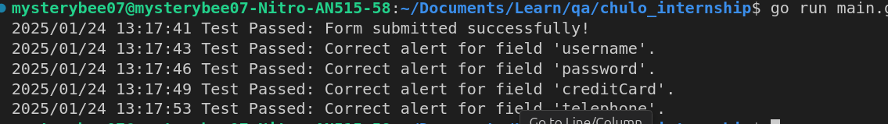

# Selenium Form Validation Automation in Go

This project demonstrates how to automate form validation testing using Selenium WebDriver with Go. The code fills a registration form with valid data, checks for successful submission, and runs a series of negative test cases to validate error handling for various input fields.

## Prerequisites

Before running the code, ensure you have the following installed:

- Go (version 1.15 or later)
- Chrome browser
- ChromeDriver (compatible with your Chrome version)

## Installing ChromeDriver
    sudo apt install chromium-chromedriver

## Running the Code

1. **Clone this repository or copy the code into a new `.go` file (e.g., `main.go`).**

2. **Open a terminal and navigate to your project directory.**

3. **Install the dependencies:**
```sh
    go mod tidy
```
4. **Run the code:**
```sh
    go run main.go
```

5. **Observe the output in the terminal:**
The program will fill out the form with valid data, check for success messages, and then execute negative test cases while logging results for each test case.




## Understanding Selenium

Selenium is an open-source suite of tools and libraries designed for automating web browsers. It provides a robust framework that allows testers and developers to create automated tests for web applications across various platforms and browsers. This capability makes Selenium a vital tool in the field of Quality Assurance (QA).

### Key Uses of Selenium in QA

- **Automated Testing**: Selenium enables the automation of repetitive testing tasks, which helps save time and reduce human error in the testing process. By simulating user interactions with web applications, it ensures that applications behave as expected.

- **Cross-Browser Testing**: Selenium supports multiple browsers, including Chrome, Firefox, Safari, and Internet Explorer. This allows QA teams to verify that web applications function consistently across different browsers, providing a seamless user experience.

- **Support for Multiple Programming Languages**: Selenium allows testers to write test scripts in various programming languages such as Java, C#, Python, Ruby, and PHP. This flexibility enables teams to utilize their preferred programming languages, enhancing productivity.

- **Integration with Other Tools**: Selenium can be easily integrated with other testing frameworks and tools like TestNG, JUnit, and Maven. This integration enhances testing capabilities and facilitates continuous integration and delivery (CI/CD) practices.

- **Parallel Testing**: Selenium supports parallel execution of tests, allowing multiple test cases to run simultaneously. This feature significantly reduces overall testing time and accelerates the software release cycle.

- **Reusable Test Scripts**: Test scripts created using Selenium can be reused across different test cases or projects. This reusability not only saves time but also ensures consistency in testing.

- **Community Support**: As an open-source tool, Selenium has a large and active community that contributes to its continuous improvement. This community provides valuable resources, support, and updates on the latest advancements in the tool.
